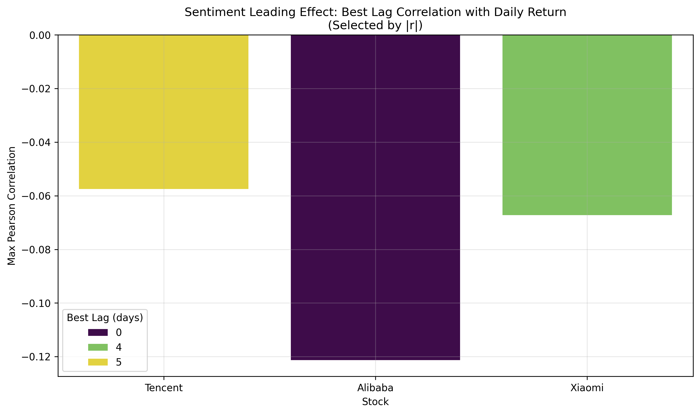
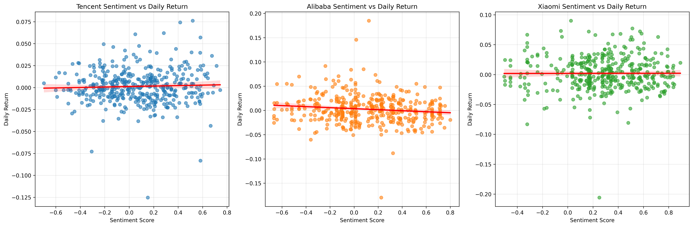

# Weibo-Sentiment-Contagion-in-HK-Tech-Stocks
## 中文版

**项目名称**：微博热搜情绪对港股科技股收益率的情感传染分析  
**研究对象**：腾讯（00700.HK）、阿里巴巴（09988.HK）、小米（01810.HK）

## 项目概述

本项目系统构建了一条**从原始数据采集到统计分析与可视化的完整量化研究闭环**，深入探究微博热搜情绪对港股三大科技巨头日收益率的影响。

## 研究方法

- 使用 `akshare` 获取三只股票**前复权日线数据**（2024年5月27日–2026年1月31日）
- 批量解析 1000 余篇微博热搜 Markdown 文件，提取日期、关键词及热度值
- 采用中文情感大模型 **Erlangshen-Roberta-110M** 对热搜关键词进行情感打分
- 对每日情绪得分进行 **EWMA(span=7)** 平滑处理
- 通过 bfill 逻辑将非交易日（周末及节假日）积压的情绪归集至下一交易日，实现情绪序列与收益率的严格对齐
- 将股价**简单收益率**与**对数收益率**与情绪序列严格日期对齐
- 开展 Pearson 与 Spearman 相关性分析，以及 **0–5 天滞后效应检验**

## 可视化结果

### 1. 情绪领先效应的最佳滞后相关性

### 2. 情绪分数与日收益率散点回归图

## 研究结论
 
- 阿里巴巴呈现**统计显著的负相关**（p < 0.05），即微博正面情绪越高，当日收益率越低， Lag 0 最明显。微博热搜情绪是有效的反向预警信号，高热度往往预示短期内利好出尽。
- 腾讯与小米的情绪-收益率关系较弱，但存在明显滞后效应（1–5 个交易日）。
- **总结**：本项目通过 bfill 逻辑的成功应用，验证了离岸市场对非交易日情绪积压的敏感性，发现港股科技股的情绪传染具有显著的“个体差异化”特征，为开发基于“利好兑现”效应的反向交易策略提供了实证支撑。

## 技术栈

**Python** | pandas | akshare | Hugging Face Transformers | scipy.stats | matplotlib | seaborn

## English Version

**Project Title**: Emotional Contagion Analysis: The Impact of Weibo Hot Search Sentiment on the Returns of Hong Kong-Listed Tech Stocks
**Stocks**: Tencent(00700.HK), Alibaba(09988.HK), Xiaomi(01810.HK)
## Project Overview
This project constructs a complete quantitative research pipeline from raw data collection to statistical analysis and visualization, exploring the **sentiment contagion effect** of Weibo hot search on the daily returns of three major Hong Kong tech stocks.

## Methodology
- Acquired adjusted daily price data for three stocks using `akshare` (May 27, 2024 – Jan 31, 2026)
- Parsed over 1,000 Weibo hot search Markdown files to extract dates, keywords, and hot values
- Applied the Chinese sentiment model **Erlangshen-Roberta-110M** to score keywords
- Performed **EWMA (span=7)** smoothing on daily sentiment scores
- Used `bfill` to align non-trading day sentiment with the next trading day
- Conducted Pearson & Spearman correlation analysis and **0–5 day lag effect testing**

## Visualization Results

### 1. Best Lag Correlation: Sentiment Leading Effect

**Interpretation**:  
This chart shows the leading effect of Weibo sentiment on stock returns. Alibaba exhibits a significant **negative correlation at Lag 0**, indicating a clear “good news already priced in” effect. Tencent and Xiaomi show moderate lagged effects.

### 2. Sentiment Score vs Daily Return Scatter Plot

**Interpretation**:  
The scatter plots illustrate the relationship between sentiment scores and daily returns. Alibaba demonstrates the strongest and statistically significant negative correlation.

## Key Findings
- Alibaba shows a **statistically significant negative correlation** (p < 0.05). Higher positive sentiment on Weibo tends to precede lower returns on the same day — acting as an effective **contrarian signal**.
- Tencent and Xiaomi exhibit weaker correlations but noticeable lagged effects (1–5 trading days).
- **Main Insight**: Hong Kong tech stocks exhibit heterogeneous responses to Weibo sentiment. The project validates the market’s sensitivity to accumulated off-trading-day sentiment and provides empirical support for contrarian strategies based on the “good news realization” effect.

## Tech Stack
**Python** | pandas | akshare | Hugging Face Transformers | scipy.stats | matplotlib | seaborn
