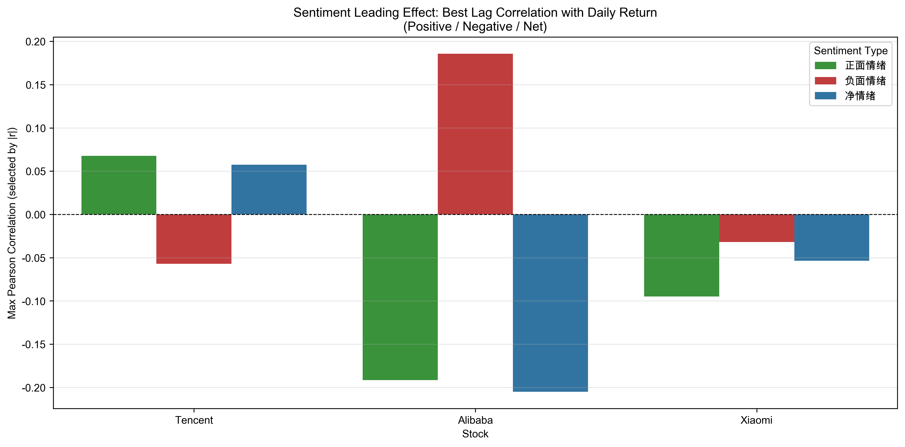
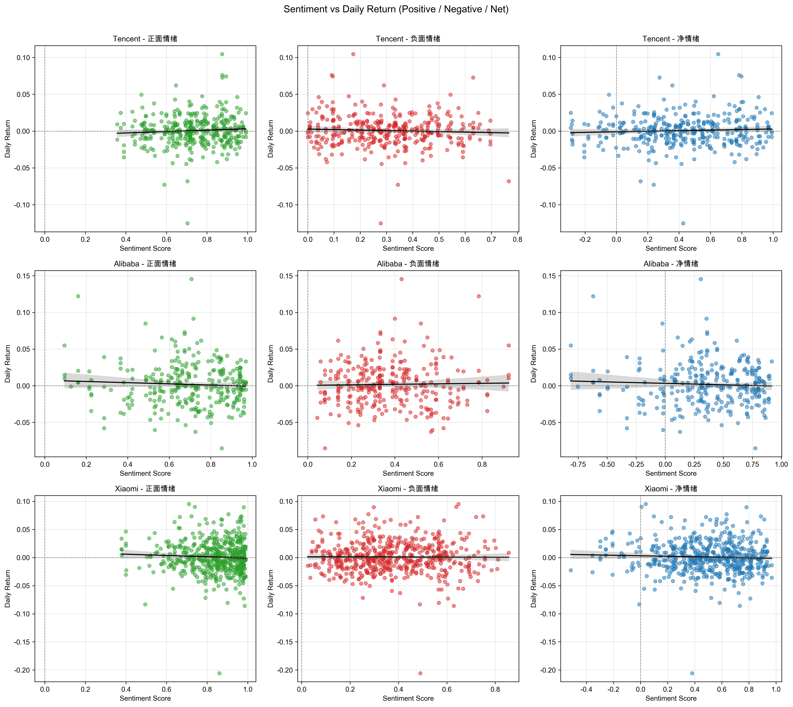

# 微博热搜情绪对港股科技股收益率的情感传染分析

**项目名称**：微博热搜情绪对港股科技股收益率的情感传染分析  
**研究对象**：腾讯（00700.HK）、阿里巴巴（09988.HK）、小米（01810.HK）

## 项目概述
本项目系统构建了一套**从原始数据采集到统计分析与可视化的完整量化研究闭环**，重点探究微博热搜情绪对港股三大科技巨头日收益率的影响，并将情绪拆分为**正面、负面与净情绪**三套指标分别检验。

## 研究方法
- 使用 `akshare` 获取三只股票**前复权日线数据**（2024年6月1日–2026年8月31日）
- 批量解析微博热搜 Markdown 文件，提取日期、关键词、分类及热度值
- 按公司相关关键词过滤后，分别计算三套每日情绪指标：正面情绪，负面情绪，净情绪
- 对中文情感模型 **IDEA-CCNL/Erlangshen-Roberta-110M-Sentiment** 进行 soft-label 微调（伪标签 + BCE 损失）
- 对三套情绪均进行 **EWMA(span=7)** 平滑
- 通过 `ffill(limit=3)` 将非交易日情绪对齐至下一交易日
- 计算简单日收益率，分别对正面 / 负面 / 净情绪开展 Pearson 与 Spearman 相关性分析，以及 **0–5 天滞后效应检验**
- 采用 Benjamini-Hochberg (BH) 方法对原始 p 值进行 FDR 校正，仅保留校正后 p < 0.05 的结果，从而控制多重检验的假发现率。

## 模型微调结果
- 训练集：1408 条样本，测试集：352 条样本
- 最佳轮次（Epoch 3）：Validation Loss = 0.1719，Accuracy = 94.89%，F1 = 96.73%，Precision = 97.44%，Recall = 96.03%

## 可视化结果

### 1. 正面 / 负面 / 净情绪的最佳滞后相关性

**解读**：  
整体相关性较弱，但部分股票在特定滞后期内呈现统计显著的信号：
- **阿里巴巴**：正面、负面、净情绪的最佳滞后均为 **Lag 4**，Pearson 相关系数分别为 r ≈ −0.19、r ≈ 0.19、r ≈ −0.20，均在 1% 水平上显著（p < 0.001）
- **小米**：正面情绪在 **Lag 4**（r ≈ −0.086，p ≈ 0.046）和 **Lag 5**（r ≈ −0.095，p ≈ 0.028）达到 5% 显著水平
- **腾讯**：在所有情绪类型与滞后期内未观察到统计显著的线性关系

### 2. 情绪分数与日收益率散点回归图

**解读**：  
九张散点图（3只股票 × 3类情绪）的同期（Lag 0）Pearson 相关性均未达到 5% 显著水平，回归线大多接近水平。

### 3. 股价与三套情绪时间序列对比图
每只股票均生成双轴时间序列图，同时展示收盘价与正面、负面、净情绪（EWMA平滑后）的走势：
- [腾讯](data/images/tencent_price_sentiment_pos_neg_net.png)
- [阿里巴巴](data/images/alibaba_price_sentiment_pos_neg_net.png)
- [小米](data/images/xiaomi_price_sentiment_pos_neg_net.png)

## 研究结论
- **整体结论**：样本期内，微博热搜的正面、负面及净情绪对三只港股日收益率的**线性预测能力整体有限**，同期相关性均不显著。但在滞后效应检验中，部分股票在特定滞后期内呈现统计显著的弱相关。
- **阿里巴巴**：正面、负面与净情绪均在滞后 **4–5 日**呈现统计显著的相关性（p < 0.001），其中正面情绪与净情绪呈负相关（r ≈ −0.19 ~ −0.20），负面情绪呈正相关（r ≈ 0.19），且均在 FDR 校正后仍显著（调整后 p < 0.05）这一"正面情绪→未来收益下降"的模式符合"利好出尽"特征。
- **小米**：正面情绪在滞后 **4–5 日**呈现微弱的负相关（r ≈ −0.086 ~ −0.095，p < 0.05），且经 FDR 校正后不再显著，负面情绪与净情绪未达显著水平。
- **腾讯**：在所有情绪类型与滞后期内几乎观察不到线性关系。
- **不对称性**：阿里巴巴同时呈现正面与负面情绪的显著滞后效应（方向相反），未发现某一方向明显强于另一方向的规律。
- **总结**：情绪传染效应是**弱的、股票特异性的、且具有时滞依赖**的。本项目提供的完整流水线（正负净情绪分离 + soft-label 微调 + EWMA 平滑 + 有限前向填充）为后续事件研究、更高频数据或非线性模型提供了可复现的研究框架。

## 技术栈
**Python** | numpy | pandas | akshare | Hugging Face Transformers | scipy.stats | matplotlib | seaborn | torch
